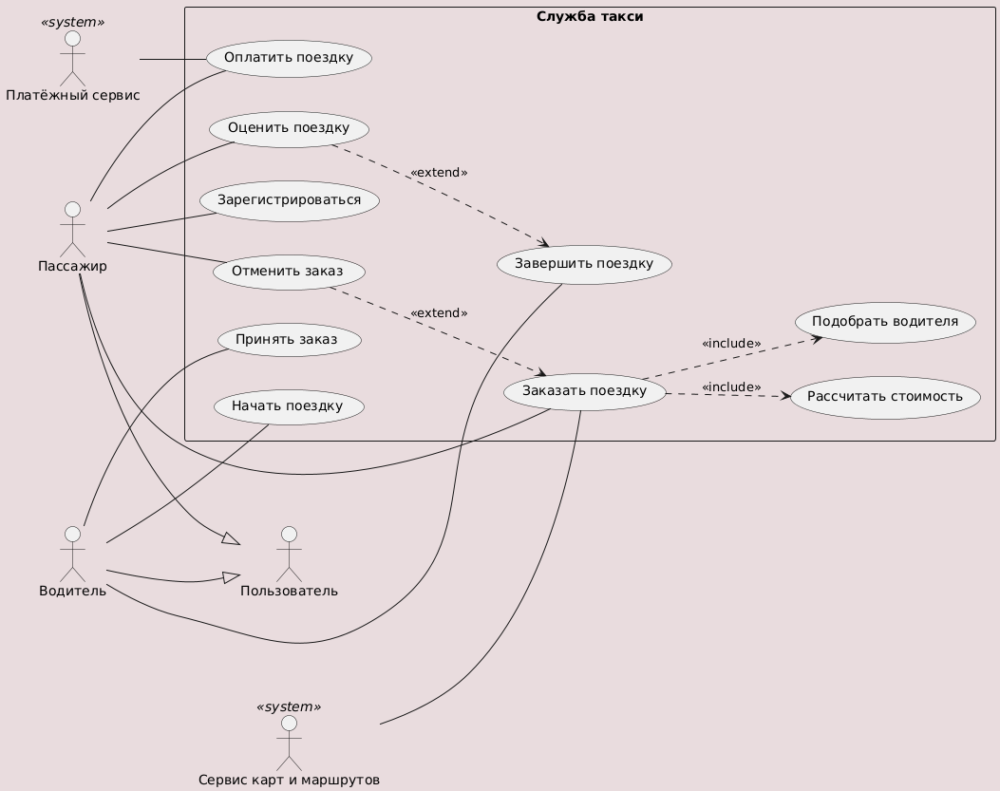
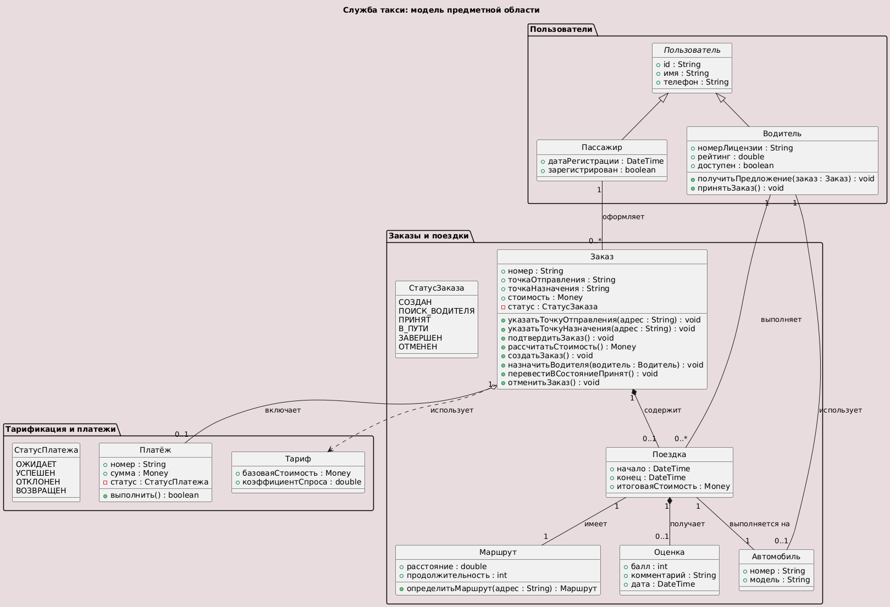
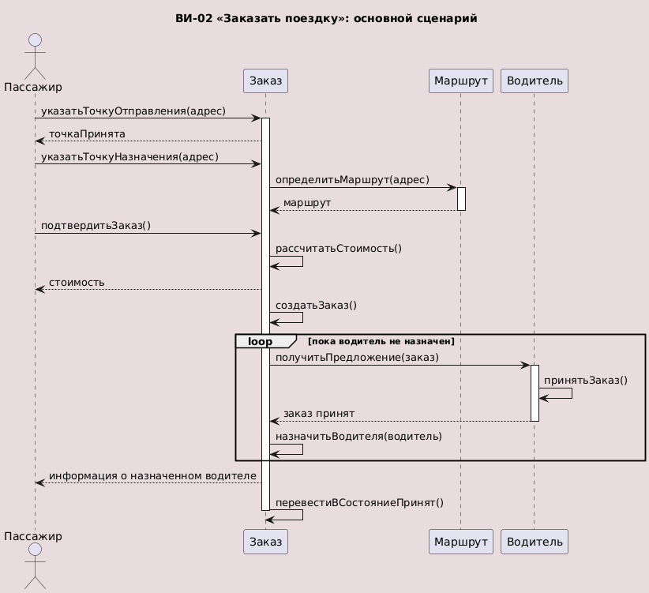
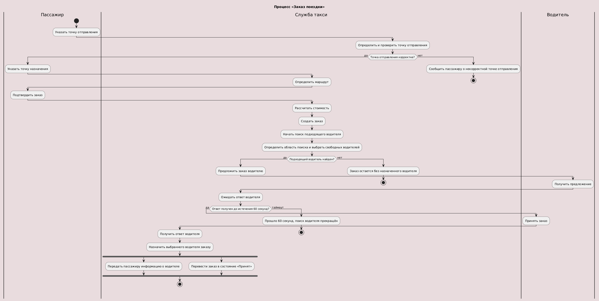
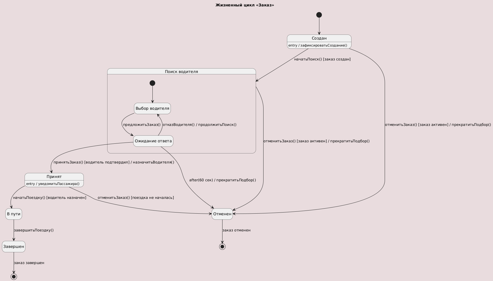
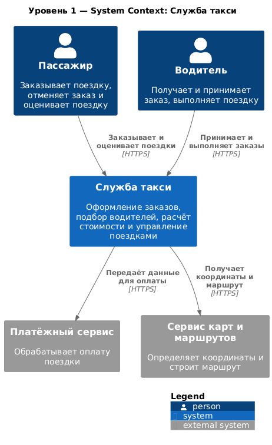
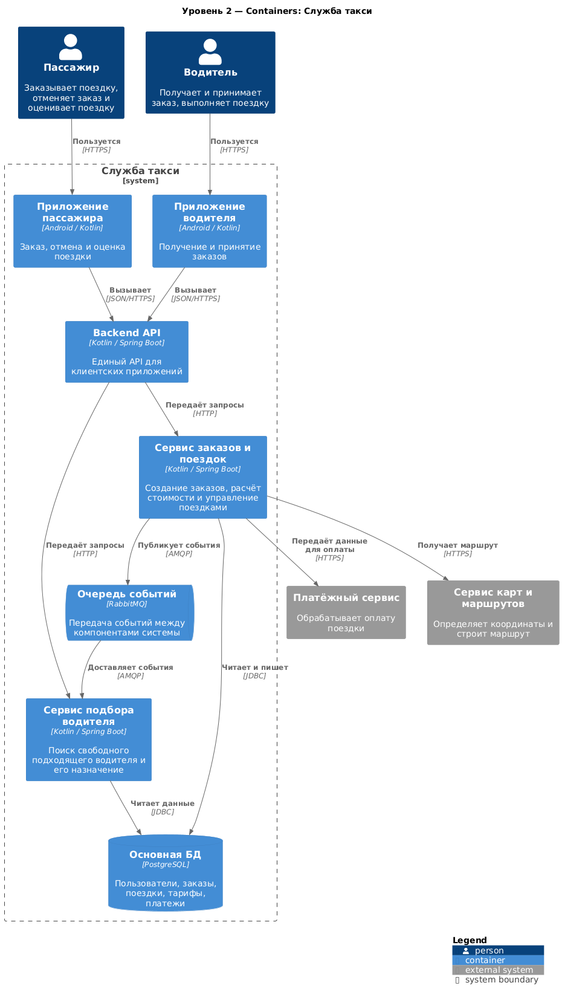
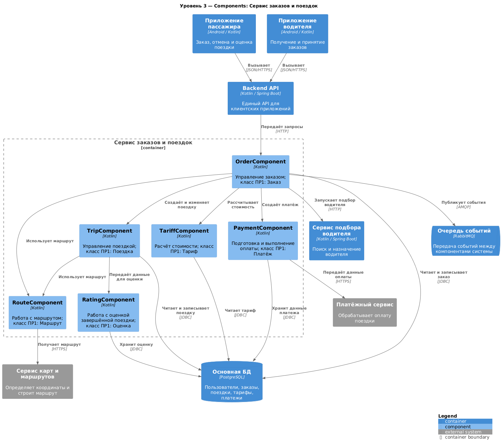
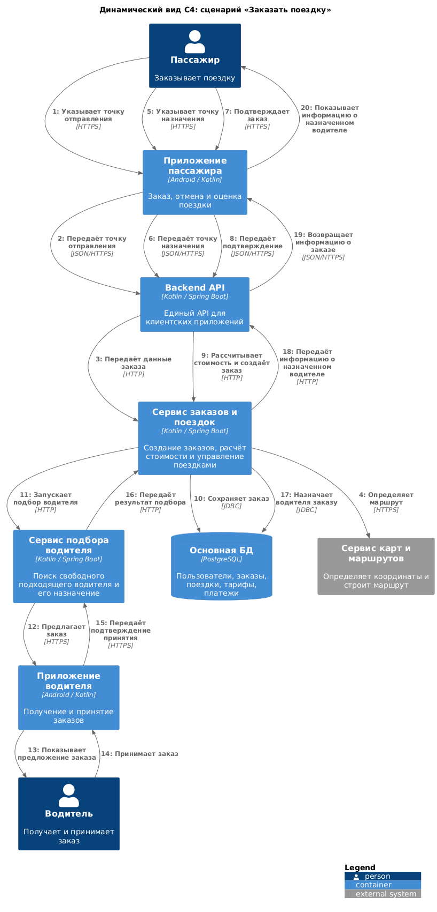

# Служба такси. Архитектурная документация

## 1. Назначение и границы

Служба такси предназначена для оформления заказов на поездки, расчёта их стоимости,
подбора подходящего водителя и управления выполнением поездки. Основными пользователями
системы являются пассажир и водитель. Пассажир создаёт и отменяет заказ, получает
информацию о назначенном водителе и оценивает завершённую поездку. Водитель получает
предложения заказов, принимает их и выполняет поездки. Система также взаимодействует
с внешним платёжным сервисом для обработки оплаты поездки. На архитектурном уровне
дополнительно предусмотрен сервис карт и маршрутов, используемый для определения
координат и построения маршрута. Внутри системы выделены приложения пользователей,
Backend API, сервис заказов и поездок, сервис подбора водителя, основная база данных
и очередь событий. Физическое развёртывание системы и конкретная инфраструктура
серверов в данной работе подробно не моделируются.

## 2. Заинтересованные стороны и их цели

| Заинтересованная сторона | Цель |
|---|---|
| Пассажир | Заказать поездку, отменить поездку и оценить поездку |
| Водитель | Получить и выполнить заказ |
| Платёжный сервис | Обработать оплату поездки |

Актёры и их задачи соответствуют модели ПР1. Пассажир и водитель являются первичными
актёрами, а платёжный сервис является внешней системой, используемой для выполнения
операции оплаты.

## 3. Функциональные требования

Диаграмма вариантов использования показывает функциональные границы службы такси
и взаимодействие основных актёров с системой. Она является основой для дальнейшей
детализации сценариев и динамических моделей.

Основные варианты использования системы:

- ВИ-01 «Зарегистрироваться» – создание учётной записи пассажира или водителя.
- ВИ-02 «Заказать поездку» – создание заказа и запуск подбора водителя.
- ВИ-03 «Рассчитать стоимость» – расчёт стоимости поездки по текущему тарифу.
- ВИ-04 «Подобрать водителя» – поиск свободного подходящего водителя.
- ВИ-05 «Принять заказ» – подтверждение водителем выполнения заказа.
- ВИ-06 «Начать поездку» – перевод заказа в состояние «В пути».
- ВИ-07 «Завершить поездку» – завершение поездки и фиксация итоговой информации.
- ВИ-08 «Отменить заказ» – отмена активного заказа.
- ВИ-09 «Оценить поездку» – сохранение оценки завершённой поездки.
- ВИ-10 «Оплатить поездку» – передача данных оплаты внешнему платёжному сервису.

ВИ-02 «Заказать поездку» включает обязательные действия расчёта стоимости и подбора
водителя и может быть расширен отменой заказа.

Диаграмма: [usecases.puml](usecases.puml).

### 3.1 Подробный сценарий – ВИ-02 «Заказать поездку»

Подробное описание основного сценария и исключений приведено в
[scenarios.md](scenarios.md). Основной сценарий включает указание точек отправления
и назначения, построение маршрута, подтверждение заказа, расчёт стоимости, создание
заказа, поиск водителя, получение его ответа и назначение водителя. При отсутствии
подтверждения водителя в течение 60 секунд подбор прекращается, а заказ переводится
в состояние «Отменен».

### 3.2 Подробный сценарий – ВИ-04 «Подобрать водителя»

Подробный сценарий приведён в [scenarios.md](scenarios.md). В нём система получает
созданный заказ, определяет область поиска, выбирает доступных водителей, проверяет
их доступность, предлагает заказ водителю и после подтверждения назначает выбранного
водителя заказу. В случае отказа водителя поиск продолжается.

## 4. Модель предметной области

Доменная модель разделяет пользователей, заказы и поездки, а также тарификацию
и платежи. Ключевым решением является сохранение «Заказа» и «Поездки» как отдельных
сущностей: заказ описывает оформление и состояние заказа, а поездка — фактическое
выполнение поездки. Между ними установлена связь, при которой один заказ может
содержать не более одной поездки. Модель также содержит отдельные сущности
«Маршрут», «Оценка», «Автомобиль», «Тариф» и «Платёж».

Подробная диаграмма: [domain.puml](domain.puml).

Ключевое решение доменной модели описано в
[ADR-0001](adr/0001-разделение-заказа-и-поездки.md).

## 5. Динамика

### 5.1 Основной сценарий – диаграмма последовательности

Диаграмма последовательности показывает взаимодействие пассажира, заказа, маршрута
и водителя при оформлении поездки. Основной сценарий соответствует ВИ-02 и показывает
последовательность ввода данных, определения маршрута, расчёта стоимости, создания
заказа и назначения водителя.

Подробная диаграмма: [main-flow.puml](03-sequence/main-flow.puml).

### 5.2 Бизнес-процесс – диаграмма деятельности

Диаграмма деятельности показывает распределение ответственности между пассажиром,
службой такси и водителем. В процессе предусмотрены проверки корректности данных,
поиск подходящего водителя, ожидание его ответа и таймаут 60 секунд. После назначения
водителя предусмотрено параллельное выполнение передачи информации пассажиру и
изменения состояния заказа.

Подробная диаграмма: [process.puml](04-activity/process.puml).

### 5.3 Жизненный цикл ключевого объекта – конечный автомат

Жизненный цикл описан для объекта «Заказ». Основные состояния отражают переход
от создания заказа к поиску водителя, принятию заказа, началу и завершению поездки
или отмене. Составное состояние «Поиск водителя» содержит внутренние состояния
«Выбор водителя» и «Ожидание ответа», а таймаут 60 секунд приводит к прекращению
подбора.

Подробная диаграмма: [lifecycle.puml](05-state/lifecycle.puml).

Таблица переходов: [transitions.md](05-state/transitions.md).

## 6. Архитектура

### 6.1 Контекст системы – C4 Level 1

На уровне Context система рассматривается как единый чёрный ящик. Она взаимодействует
с пассажиром, водителем, платёжным сервисом и сервисом карт и маршрутов. Технологии
внутри системы на этом уровне не показываются. Это позволяет определить границы
системы и её внешние взаимодействия без детализации внутреннего устройства.

Диаграмма: [01-context.puml](06-c4/01-context.puml).

### 6.2 Контейнеры – C4 Level 2

На уровне Container система разделена на отдельно развёртываемые части. В архитектуре
выделены приложения пассажира и водителя, Backend API, сервис заказов и поездок,
сервис подбора водителя, основная БД и очередь событий. Такое разделение позволяет
отделить пользовательские приложения от серверной бизнес-логики, хранения данных
и обработки событий.

Диаграмма: [02-container.puml](06-c4/02-container.puml).

### 6.3 Компоненты – C4 Level 3

На уровне Component раскрыт только контейнер «Сервис заказов и поездок». Внутри него
выделены компоненты управления заказом, поездкой, маршрутом, тарифом, платежом
и оценкой. Каждый компонент сопоставлен с соответствующим классом ПР1, что позволяет
проследить переход от доменной модели к архитектурной реализации.

Диаграмма: [03-component.puml](06-c4/03-component.puml).

### 6.4 Развёртывание

Физическая диаграмма развёртывания UML в рамках работы не создавалась. На данном
этапе архитектура описывается на логических уровнях C4 Context, Container и Component,
а физическое размещение серверов и узлов не детализируется.

### 6.5 Динамический вид C4

Динамический вид показывает сценарий «Заказать поездку» на уровне контейнеров.
Пронумерованные шаги отражают взаимодействие пассажира, клиентских приложений,
Backend API, сервиса заказов, сервиса подбора водителя, приложения водителя,
базы данных и сервиса карт и маршрутов. Диаграмма связывает архитектуру C4
с динамикой, разработанной в ПР2.

Диаграмма: [04-dynamic.puml](06-c4/04-dynamic.puml).

### 6.6 Модель Structurizr DSL

Единая модель архитектуры дополнительно описана в
[workspace.dsl](06-c4/workspace.dsl). Из неё формируются представления Context,
Container и Component. Такой подход уменьшает дублирование названий элементов
и позволяет поддерживать несколько представлений одной архитектурной модели.

## 7. Архитектурные решения

### ADR-0001. Заказ и поездка хранятся как отдельные сущности

[0001-order_and_trip.md](adr/0001-order_and_trip.md)

Решение сохраняет разделение между оформлением заказа и фактическим выполнением
поездки.

### ADR-0002. Подбор водителя выделен в отдельный сервис

[0002-driver_selection_service.md](adr/0002-driver_selection_service.md)

Решение отделяет ответственность за создание и управление заказом от логики поиска
и назначения подходящего водителя.

### ADR-0003. Для передачи внутренних событий используется очередь RabbitMQ

[0003-sequence_events.md](adr/0003-sequence_events.md)

Решение предусматривает использование очереди событий для внутренних событий системы,
при этом синхронные HTTP-вызовы сохраняются для запросов, требующих непосредственного
ответа.

## 8. Что осталось за рамками

В текущей модели не детализировано физическое развёртывание системы: серверы, узлы,
порты и конкретная инфраструктура не представлены отдельной UML deployment
диаграммой. Не разработана отдельная динамическая модель для каждого из десяти
вариантов использования; основная динамика сосредоточена вокруг ВИ-02 и связанных
с ним действий. Регистрация пользователя, оценка поездки и оплата представлены
в функциональной модели, но их внутренние архитектурные сценарии подробно не
разрабатывались. Реальная реализация платёжного сервиса и сервиса карт и маршрутов
также не входит в текущую модель. Конкретные алгоритмы выбора водителя, отказоустойчивость
и физические характеристики инфраструктуры требуют отдельной детализации.